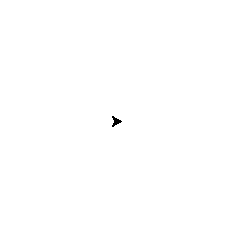

# Explore and Navigate a Virtual Maze

My solution for Udacity's robot motion planning project.

<p align="center">

</p>

---

## Description

A simulated robot-like agent is placed in the corner of a grid-like maze with the task to **find the shortest path to the maze's center**.
The agent is equipped with three range-limited ranging sensors pointing to the front, left and right side of the agent.
**It has no knowledge of the maze map** and has to construct a representation of the maze in order
to find the shortest path.

The program runs in two phases:

1. In the exploration phase, the agent maps out the maze and stores an internal representation.
2. In the racing phase, the agent tries to use it's movement capabilities as efficient as possible to reach the destination on the shortest path in the shortest time.
    
[Trémaux's algorithm](https://en.wikipedia.org/wiki/Maze_solving_algorithm#Tr%C3%A9maux's_algorithm) is used during exploration and mapping
as an implementation of a depth-first search for planning the agent's movements and to obtain the complete map of the maze.

Afterwards, the internal map is treated as a graph and [Dijkstra's algorithm](https://en.wikipedia.org/wiki/Dijkstra%27s_algorithm) is used to create an action policy for the agent which enables it afterwards to reach the maze center on the shortest path while using it's limited actions efficiently.

### Files

* `robot.py`: Contains the implementation of the AI algorithms to explore and map the maze,
find the shortest path and race to the goal on the shortest path. It also has the code that simulates  a robot with limited capabilities and logs the paths
the robot has taken to a log file called `path.json`. Comments are provided in the code,
explaining the details of the implementation.

* `run.py`: Tester code to evaluate the agent implementation on a maze and display the results afterwards.

* `showmaze.py`: Contains visualization code to plot a maze and show the exploration of a maze and
the race to the goal on the shortest path.

## Setup

### Install using pipenv
```bash
# Execute in respository root
pipenv install
pipenv shell
cd maze_exploration
```
### Manual installation requirements
- numpy
- tkinter

## Usage

Execute `run.py` inside the `maze_exploration` directory, giving a maze definition text file as an argument.

**Example: Run programn and visualize results:**
```bash
# Execute in maze_exploration folder
python run.py maze_01.txt
```

**Example: Visualize a maze file:**
```bash
# Execute in maze_exploration folder
python showmaze.py maze_01.txt
```
